# Data Structure (*with C-Language*)

## 1. Array List Functions (<u>Week02</u>)
- ["Phase1.c"](./Week02/Phase1.c)
- ["Phase2.c"](./Week02/Phase2.c)
- ["Phase3.c"](./Week02/Phase3.c)
- ["Phase4.c"](./Week02/Phase4.c)
- ["Phase5.c"](./Week02/Phase5.c)
> [ Phase4 on Terminal ]
> 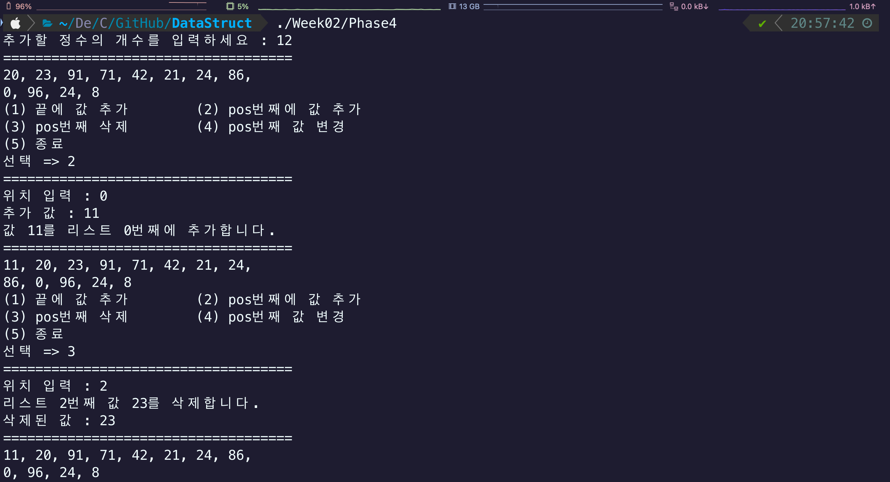
> [ Phase5 on Terminal ]
> 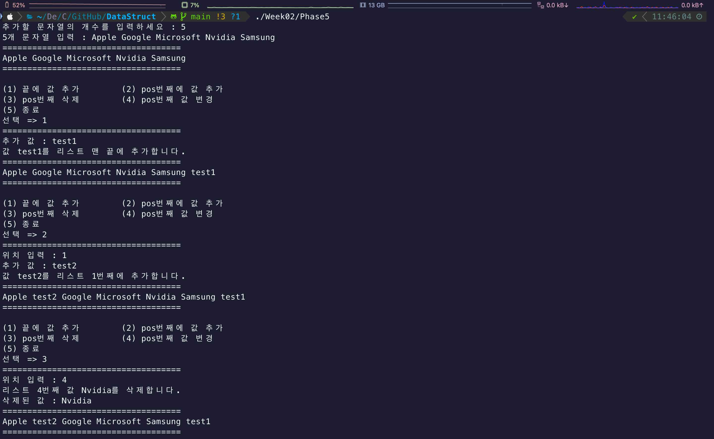

---

## 2. Array List using ADT(Abstract Data Type) structure (<u>Week03</u>)
### 2-1) ADT structure
> [ ADT Struct ]
>```c
>typedef struct {
>    int arr[MAX];
>    int size;
>} arrlist_t;
>
>arrlist_t list;
>```
- ["ArrListPhase1.c"](./Week03/ArrListPhase1.c)
- ["ArrListPhase2.c"](./Week03/ArrListPhase2.c)
> [ ArrListPhase2 on Terminal ]
> 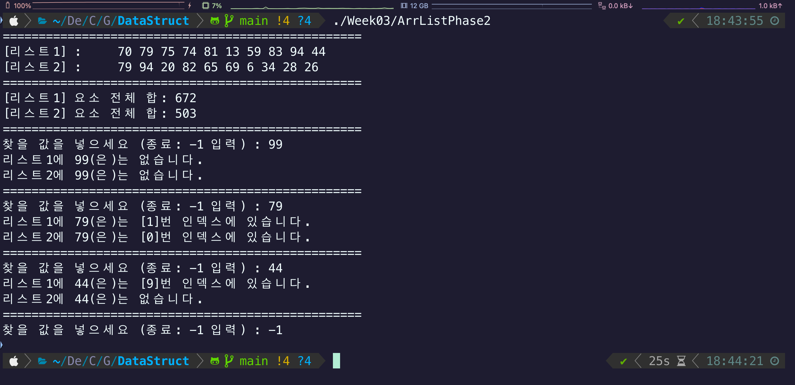

### 2-2) Code separation
> [ Linking example ]
> 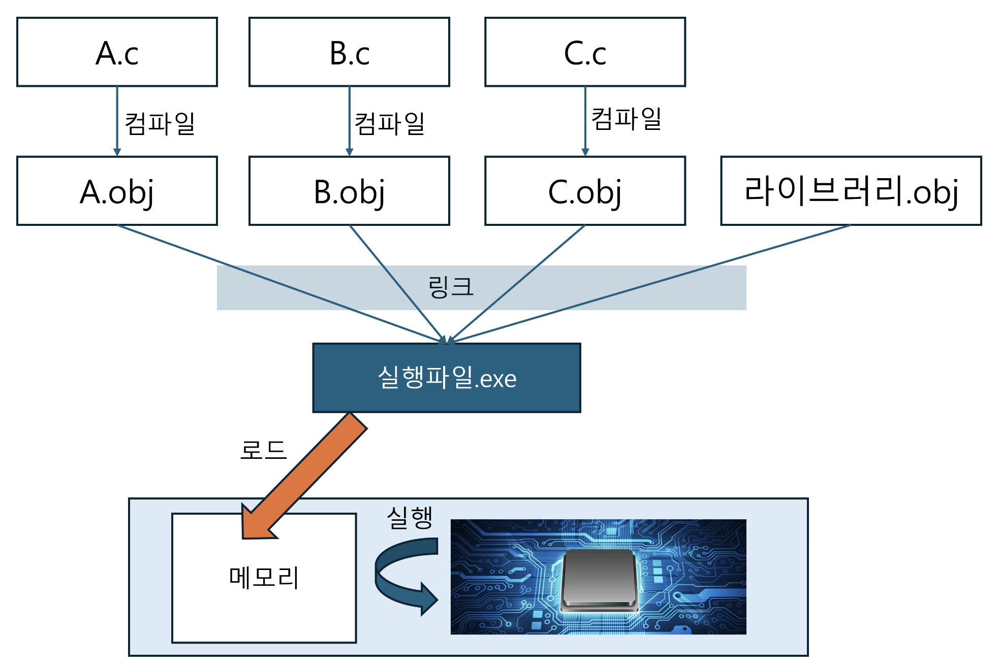
> [ UDH example ]
> 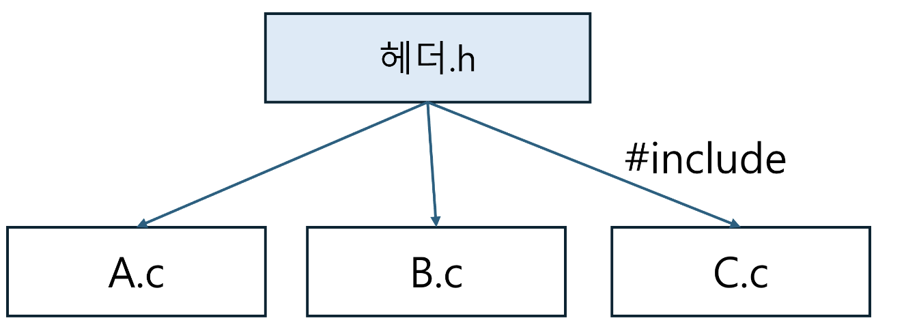
- ["Separate/main.c"](./Week03/Separate/main.c)
- ["Separate/Arrlist.h"](./Week03/Separate/Arrlist.h)
- ["Separate/Arrlist.c"](./Week03/Separate/Arrlist.c)

---

## 4. Stack Implimentation (<u>Week05</u>)
> [ Stack example ]
>
> 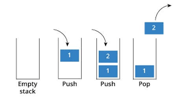
### 4-1) Stack ADT structure
> [ Stack ADT Struct & Functions ]
>```c
>typedef int elem_int; // 정수 타입 자료형을 elem_int로 정의
>typedef struct Stack {
>    int* data; // 동적 할당을 위한 스택 포인터 변수
>    int top; // top 변수 (기본 0)
>    int capacity; // 스택 용량(크기) 변수
>} stk_t;
>
>void init_stack(stk_t* st); // 스택 초기화
>int is_empty(stk_t* st); // 스택이 비었는가
>int is_pull(stk_t* st); // 스택이 가득 찼는가
>void push(stk_t* st, int data); // 스택에 push 하기
>int pop(stk_t* st); // 스택에 pop 하기
>int peek(stk_t* st); // 스택에 peek 하기
>void print_stack(stk_t* st); // 스택 공간 출력
>void free_stack(stk_t* st); // 스택 공간 메모리 반납
>```
- ["Stack/Stack.h"](./Week05/Stack/Stack.h)
- ["Stack/Stack.c"](./Week05/Stack/Stack.c)
- ["Stack/StackMain.c"](./Week05/Stack/StackMain.c)
> [ StackMain on Terminal ]
> 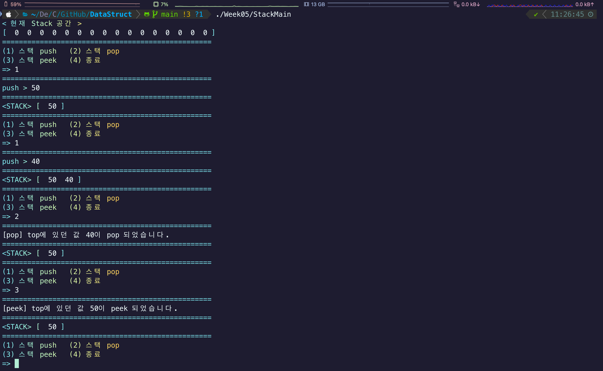

### 4-2) Paren checking using stack
> [ Paren check example]
>
> 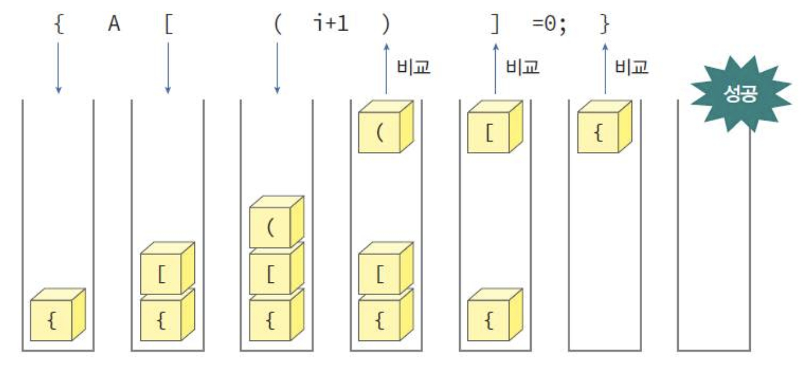
>```c
>int is_open(char paren); // 여는 괄호 확인
>int is_closing(char paren); // 닫는 괄호 확인
>int matching(char open_pr, char pr); // 여닫는 괄호가 일치하는지 확인
>void print_line(stk_t* st, char* parens); // 문자열과 스택 출력
>int paren_check(char* parens); // 괄호 검사 함수
>```
- ["ParenCheck/Stack.h"](./Week05/ParenCheck/Stack.h)
- ["ParenCheck/Stack.c"](./Week05/ParenCheck/Stack.c)
- ["ParenCheck/ParenCheck.c"](./Week05/ParenCheck/ParenCheck.c)
> [ ParenCheck on Terminal ]
> 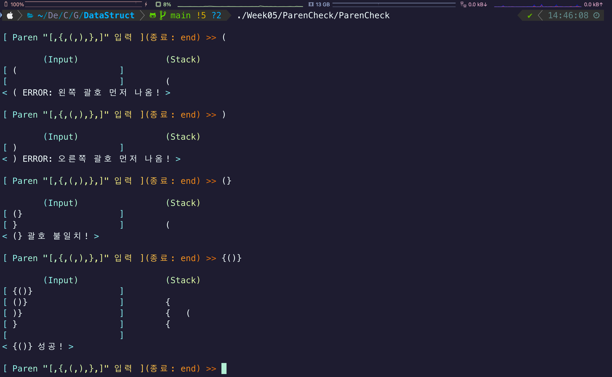

---

## 5. Circular Queue Implimentation (<u>Week07</u>)
> [ Queue example ]
>
> 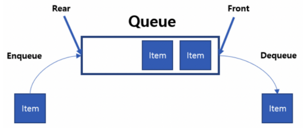
### 5-1) Queue ADT structure
> [ Queue ADT Struct & Functions ]
>```c
>typedef int elem_int; // elem_int 정의
>
>typedef struct Queue { // Queue 구조체
>    elem_int data[MAX_QUEUE_SIZE]; // Queue 공간
>    int rear; // rear = (맨뒤)다음 데이터가 들어갈 공간
>    int front; // front = (맨앞)데이터가 제일 처음 들어온 공간 (dequeue시 front값이 나감)
>} que_t;
>
>void init_queue(que_t* que); // Queue 초기화.
>elem_int is_empty(que_t* que); // 공간 Empty 확인. (True: front == rear) : 때문에 원형 큐는 공간 1개는 비워둬야 함.
>elem_int is_full(que_t* que); // 공간 Full 확인. (True: front == (rear + 1) % MAX_SIZE)
>void enqueue(que_t* que, elem_int val); // 맨뒤에 값을 넣음. (data[rear] = value; rear = (rear + 1) % MAX_SIZE)
>elem_int dequeue(que_t* que); // 맨값 값을 내보냄. (return data[front]; front = (front + 1) % MAX_SIZE)
>elem_int peek(que_t* que); // front값을 내보내지 않고 출력 (return data[front])
>void print_queue(que_t* que); // Queue 출력
>```
- ["Queue/Queue.h"](./Week07/Queue/Queue.h)
- ["Queue/Queue.c"](./Week07/Queue/Queue.c)
- ["Queue/QueueMain.c"](./Week07/Queue/QueueMain.c)
> [ QueueMain on Terminal ]
> 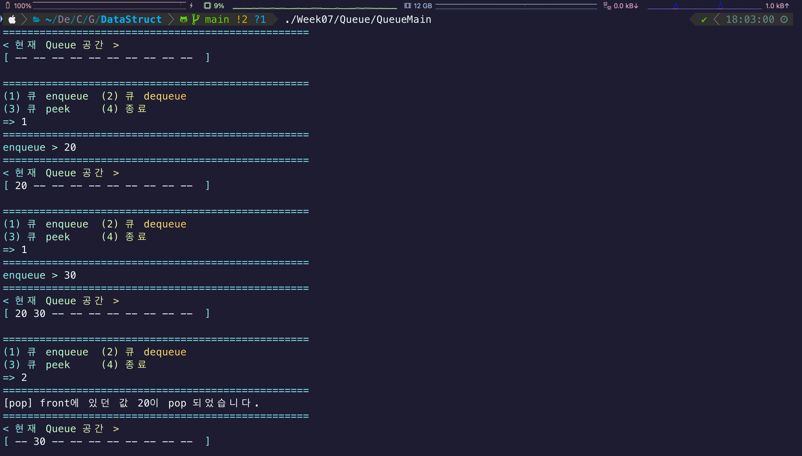

---